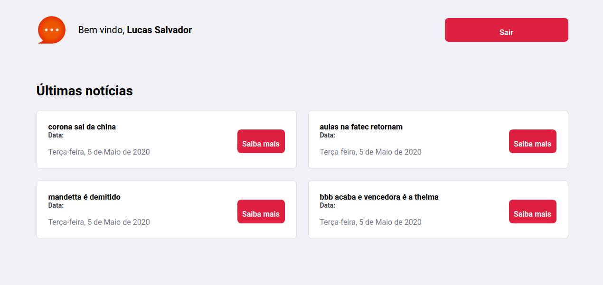
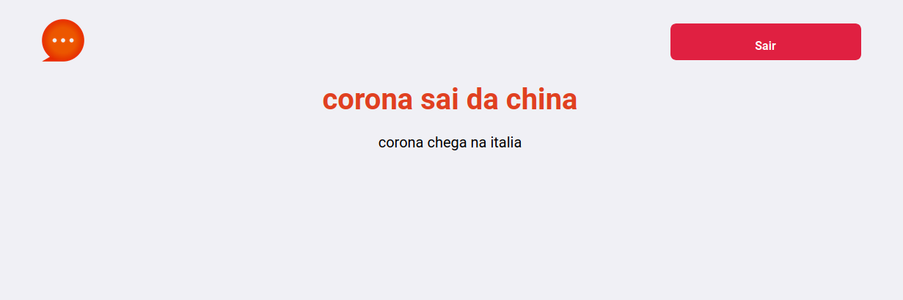
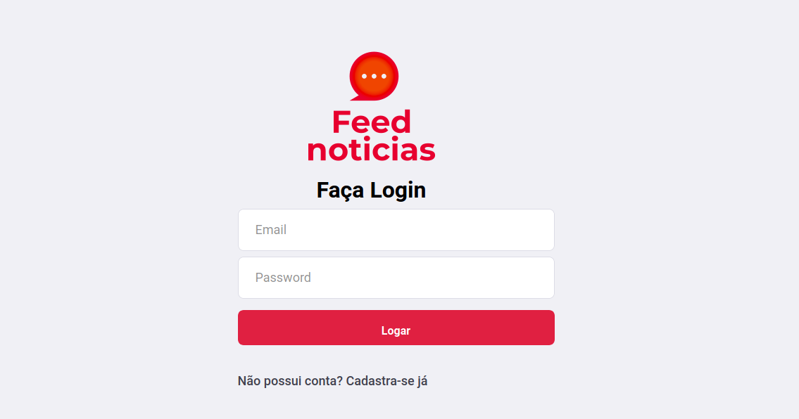
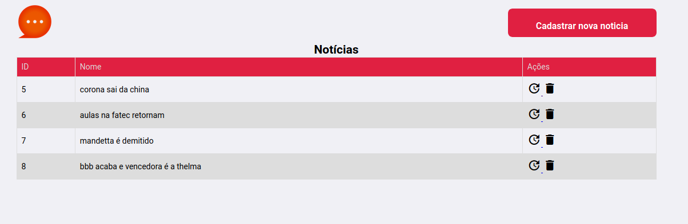
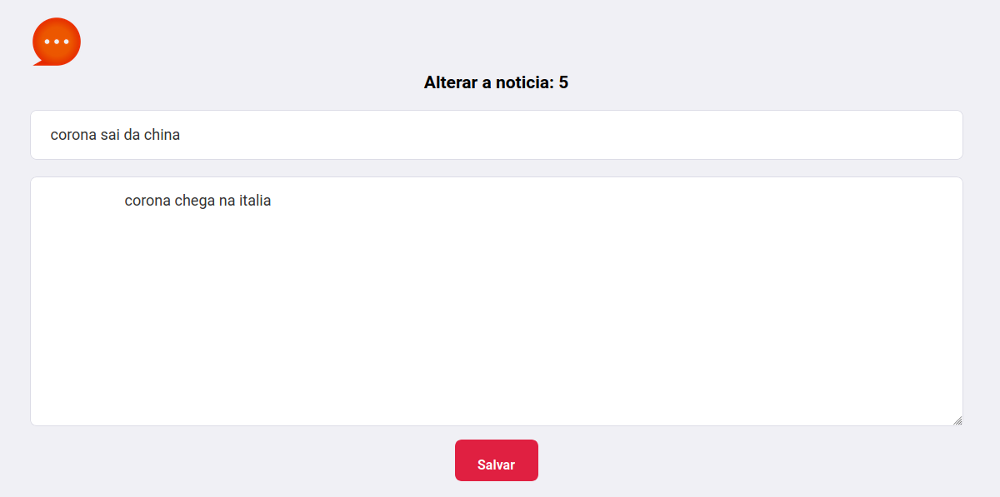
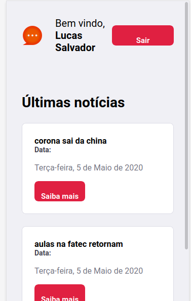
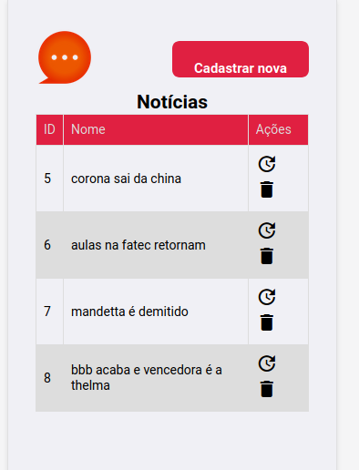
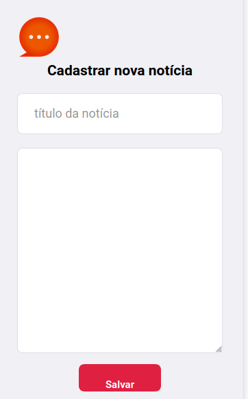

# Feed noticias
Feed noticias é um portal de notícias construído com Java, usando Servlet, JSP e JPA com Hibernate. Além disso, utilizou-se HTML5, CSS3, JavaScript e Jquery com  para construção de interfaces. Como ferramenta de build utilizou-se o Gradle. Nele um usuário pode olhar o feed e acessar uma notícia, caso ele não esteja logado não poderá ver o corpo da notícia. Caso ele não tenha conta poderá efetuar cadastro e ter acesso as notícias

## Pre requisitos

* Java (JDK e JRE)
* Gradle
* MySqlServer

## Telas Desktop

### Tela de Inicio

### Tela de Feed Logado

### Tela de Feed Deslogado

### Tela de Noticia Deslogado

### Tela de Noticia Logado

### Tela de Cadastro

### Tela de Login

### Tela Painel de Admin

### Tela Gerenciar Usuários

### Tela Gerenciar Notícias

### Tela Cadastro Notícias

### Tela Atualização Notícias

## Telas mobile

### Tela de Inicio

### Tela de Feed Logado

### Tela de Feed Deslogado

### Tela de Noticia Deslogado

### Tela de Noticia Logado

### Tela de Cadastro

### Tela de Login

### Tela Painel de Admin

### Tela Gerenciar Usuários

### Tela Gerenciar Notícias

### Tela Cadastro Notícias

### Tela Atualização Notícias

