# Feed noticias
Feed noticias é um portal de notícias construído com Java, usando Servlet, JSP e JPA com Hibernate. Além disso, utilizou-se HTML5, CSS3, JavaScript e Jquery com  para construção de interfaces. Como ferramenta de build utilizou-se o Gradle. Nele um usuário pode olhar o feed e acessar uma notícia, caso ele não esteja logado não poderá ver o corpo da notícia. Caso ele não tenha conta poderá efetuar cadastro e ter acesso as notícias

## Pre requisitos

* Java (JDK e JRE)
* Gradle
* MySqlServer
 
## Rotas

### Rota:/
#### Método HTTP: GET

Ação: Retorna pagina de index

Parametros: Vazios

Pagina retornada: webapp/index.html

### Rota:/admin
#### Método HTTP: GET

Ação: Retorna pagina de painel de adminstrador

Controller: java/feed/noticias/controller/AdminController.java

Parametros: Vazios

Pagina retornada: webapp/WEB-INF/admin.jsp

### Rota:/cadastro
#### Método HTTP: GET

Ação: Retorna pagina de cadastro

Controller: java/feed/noticias/controller/CadastroController.java

Parametros: Vazios

Pagina retornada: webapp/WEB-INF/admin.jsp

#### Método HTTP: POST

Ação: Realiza o cadastro de um novo usuário

Controller: java/feed/noticias/controller/CadastroController.java

Parametros: Body Params(nome, email, senha)

Rediceriona: webapp/WEB-INF/feed.jsp

### Rota:/feed
#### Método HTTP: GET

Ação: Paga todas a noticias cadastradas e retona para gerar o feed de noticias

Controller: java/feed/noticias/controller/FeedController.java

Parametros: Vazios

Pagina retornada: webapp/WEB-INF/feed.jsp

### Rota:/login
#### Método HTTP: GET

Ação: Retorna pagina de login

Controller: java/feed/noticias/controller/LoginController.java

Parametros: Vazios

Pagina retornada: webapp/WEB-INF/login.jsp

#### Método HTTP: POST

Ação: Realiza o login de um usuário

Controller: java/feed/noticias/controller/LoginController.java

Parametros: Body Params(email, senha)

Rediceriona: se for usuário normal para `webapp/WEB-INF/feed.jsp` se for admin para `webapp/WEB-INF/admin.jsp`

### Rota:/sair
#### Método HTTP: GET

Ação: Limpa a sessão do usuário

Controller: java/feed/noticias/controller/LogoutController.java

Parametros: Vazios

Redireciona: webapp/WEB-INF/feed.jsp

### Rota:/noticia
#### Método HTTP: GET

Ação: Caso o usuário esteja logado traz titulo e corpo de noticia, se não só título.

Controller: java/feed/noticias/controller/NoticiaController.java

Parametros: Query Params(id)

Pagina retornada: webapp/WEB-INF/noticia.jsp

#### Método HTTP: DELETE

Ação: Deleta uma noticia

Controller: java/feed/noticias/controller/

NoticiaController.java
Parametros: Query Params(id)

### Rota:/noticias
#### Método HTTP: GET

Ação: Seleciona e lista todas as noticias disponíveis

Controller: java/feed/noticias/controller/NoticiasController.java

Parametros: Vazio

Pagina retornada: webapp/WEB-INF/noticias.jsp

### Rota:/salvar
#### Método HTTP: GET

Ação: Caso tenho o params(id) retorna o conteudo da noticia com id passado no parametro para ser editado, senão traz tela limpa para cadastrar nova noticia 

Controller: java/feed/noticias/controller/SalvarNoticiasController.java

Parametros: Query Params(id)

Pagina retornada: webapp/WEB-INF/salvar.jsp

#### Método HTTP: POST

Ação: Cadastrar uma nova noticia

Controller: java/feed/noticias/controller/SalvarNoticiasController.java

Parametros: BodyParams(titulo e corpo)

#### Método HTTP: PUT

Ação: Altera uma noticia já existente com id passado por parametro

Controller: java/feed/noticias/controller/SalvarNoticiasController.java

Parametros: Query Params(id) , BodyParams(titulo e corpo)

### Rota:/usuario
#### Método HTTP: GET

Ação: Traz uma pagina com os dados do usuario

Controller: java/feed/noticias/controller/UsuarioController.java

Parametros: Query Params(id)

Pagina retornada: webapp/WEB-INF/usuario.jsp

#### Método HTTP: DELETE

Ação: Deleta o usuario

Controller: java/feed/noticias/controller/UsuarioController.java

Parametros: Query Params(id)

### Rota:/usuarios
#### Método HTTP: GET

Ação: Traz uma lista de todos os usuário cadastrados

Controller: java/feed/noticias/controller/UsuariosController.java

Parametros: Vazio

Pagina retornada: webapp/WEB-INF/usuarios.jsp

## Telas Desktop

### Tela de Inicio
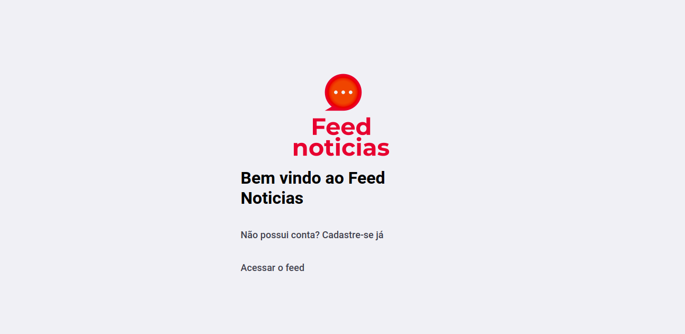

### Tela de Feed Logado

### Tela de Feed Deslogado

### Tela de Noticia Deslogado
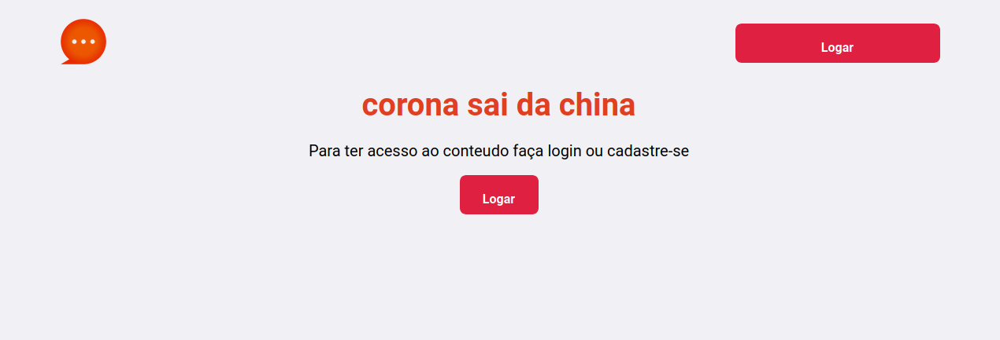

### Tela de Noticia Logado

### Tela de Cadastro
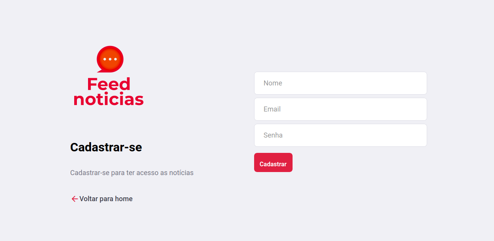

### Tela de Login

### Tela Painel de Admin
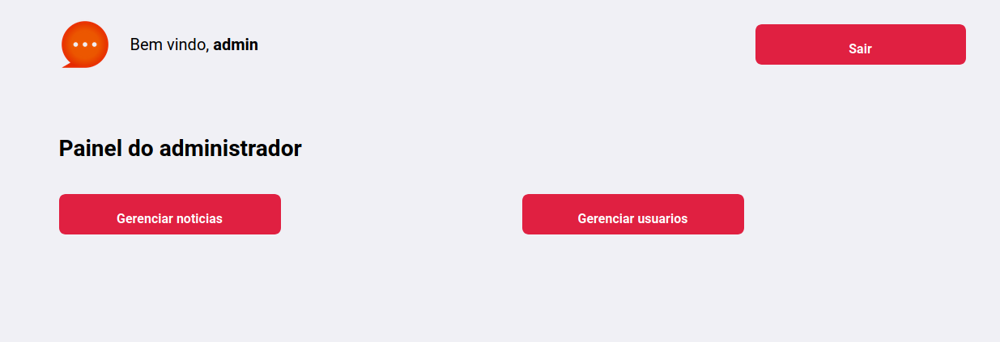

### Tela Gerenciar Usuários
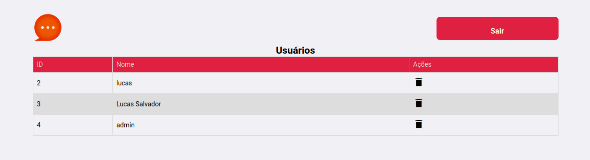

### Tela Gerenciar Notícias

### Tela Cadastro Notícias
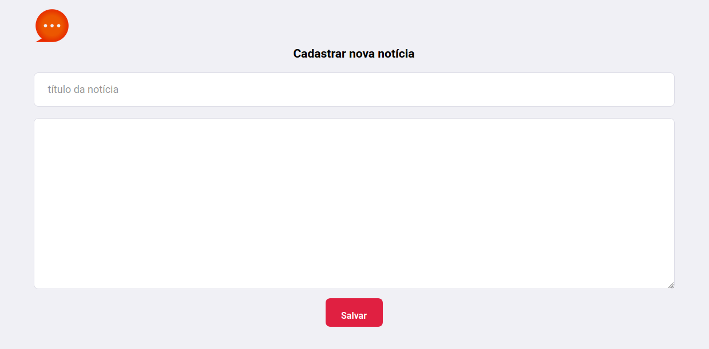

### Tela Atualização Notícias

## Telas mobile

### Tela de Inicio

### Tela de Feed Logado

### Tela de Feed Deslogado
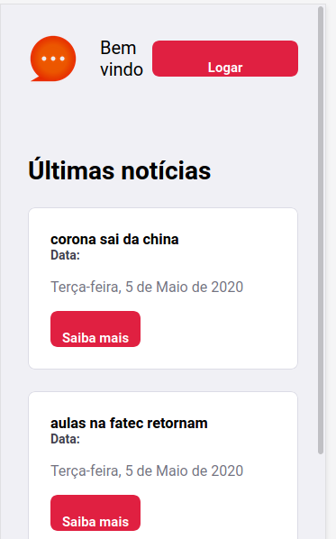

### Tela de Noticia Deslogado

### Tela de Noticia Logado
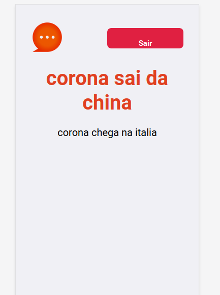

### Tela de Cadastro
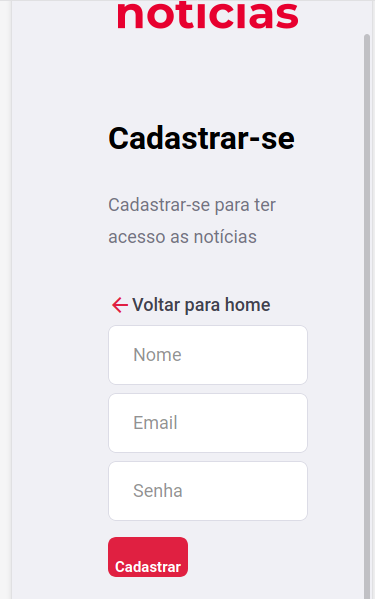

### Tela de Login
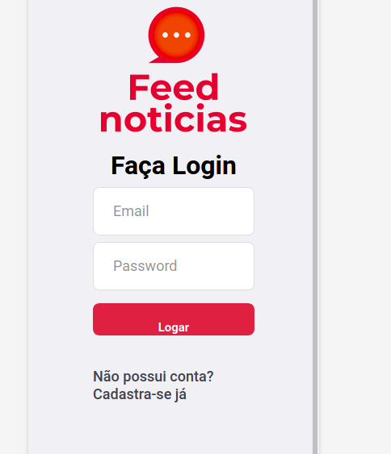

### Tela Painel de Admin
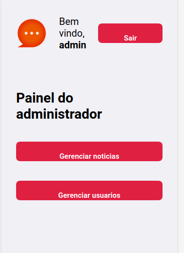

### Tela Gerenciar Usuários

### Tela Gerenciar Notícias

### Tela Cadastro Notícias

### Tela Atualização Notícias

